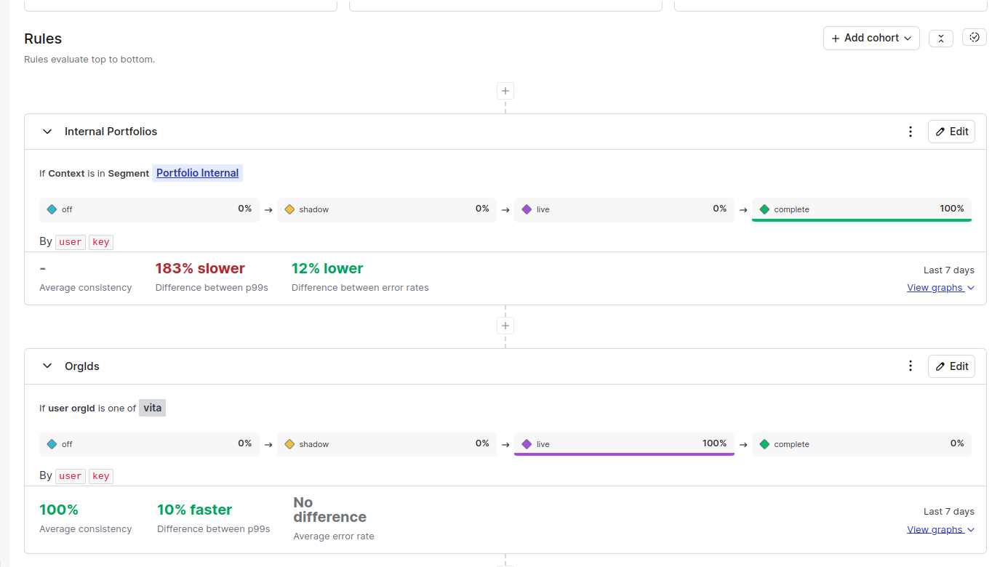

# LaunchDarkly Naive PoC

This PoC aims to test the LaunchDarkly tool for managing feature flags in a Node.js (server-side) application using the SDK: `"@launchdarkly/node-server-sdk": "^9.4.7"`. The primary focus is on the [multi-stage migration feature](https://docs.launchdarkly.com/guides/flags/migrations).

## Setup

Set the LaunchDarkly SDK key:

```sh
export LAUNCHDARKLY_SDK_KEY=YOUR_KEY
```

### Emulating Traffic

1. Start the server: node migration.js
2. Emulate traffic with k6: k6 run test.js

> Note: This example may not be the most cost-effective and should be used with caution in a production environment.

### Insights

- Latency tracking and error tracking are enabled by default. The callbacks for the new and old systems execute concurrently by default. [More details here](https://launchdarkly.github.io/js-core/packages/sdk/server-node/docs/interfaces/LDMigrationOptions.html)
- The multi-stage migration feature works effectively. We can create rules to enable traffic for specific users, organizations (custom attributes), or even user groups(see [Targeting](https://docs.launchdarkly.com/home/flags/target)).
- We can switch the response from the legacy system to the new system and still use the consistency check feature before releasing the new system to all users.
- We can also segment these requests by rule and by key!
- For "read only" migration systems we can use [4 stage migrations](https://docs.launchdarkly.com/guides/flags/migrations#when-to-use-a-four-stage-migration) which includes:
    - off: data is read from and written to only the old system
    - shadow: data is read from and written to both systems, but returned from only the old system
    - live: data is read from and written to both systems, but returned from only the new system
    - complete: data is read from and written to only the new system



